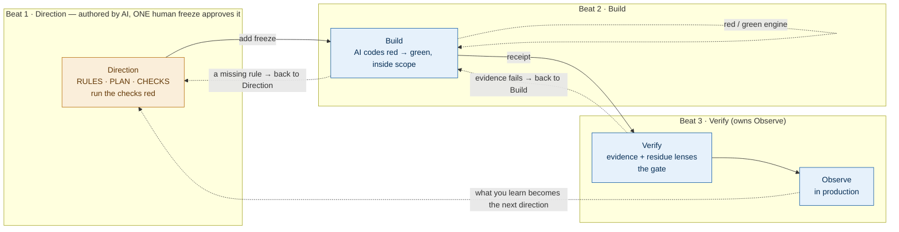

# 02 · The three-beat loop, and what is disposable

[← 01 Core principles](./01-principles.md) · [Contents](./README.md) · Next: [03 Direction — rules, plan, checks →](./03-direction.md)

---

## The loop

ADD is one repeatable loop with **three beats** and exactly **one human decision** in the middle:

**DIRECTION → (one `add freeze`) → BUILD → VERIFY.**

- **Direction** is the steering. The AI authors one node — its **RULES** (what it must do and must refuse), its **PLAN** (the contract it will honour and the strategy to get there), and its **CHECKS** (the red suite that will judge the build) — and runs the checks red for the right reason. A person then freezes it, once.
- **Build** is the engine. With direction frozen, the AI writes code until the red checks go green, staying inside the declared scope and never touching a check or the frozen contract.
- **Verify** is the proof. The build's evidence is gathered, the residue that tests cannot cover is examined, and the change is gated. Verify also owns **Observe** — what production teaches feeds back into the next task's Direction.

The whole loop costs three engine calls:

```text
add new <slug>                                # open the node, author Direction
add freeze <slug> --by "<name>" --authority human   # the one human decision
add gate PASS                                 # the verdict — auto-closes the task
```

Everything else — grounding the code, drafting the rules, running the reds, writing the build — happens *inside* those beats. The single stop for a person is the freeze.

**Grounding is the first part of Direction, not a separate beat.** Before it drafts anything, the AI gathers the real code the task touches — the actual files, symbols, signatures, and conventions — into a lean grounding map, surfacing the anchors the frozen contract will later cite. Grounding is AI-owned and adds no approval; it aims the whole node at reality instead of assumption.



> **Three beats, one decision.** Direction gathers rules, plan, and checks into a single span that ends at the freeze; Build runs on the far side; Verify owns Observe. The human is asked once — at `add freeze` — because that is the only point where a person, not evidence, must decide.

> **Solid arrows are the primary flow** — you never open a beat before its input exists (forward-skip forbidden). **Dashed arrows are backward correction** — any beat may return to an earlier one to repair its artifact: a build that exposes a missing rule folds it back into Direction, and that is the loop working ([principle 4](./01-principles.md)), not a failure. The tight self-loop on Build is the per-task red/green engine, running the frozen checks until they pass.

The shape is deliberate: Direction establishes the steering, the frozen contract forms the decision point in the middle, and the AI-led build runs fast and safely on the far side because everything it needs is already fixed.

## Many features, one at a time — listed up front, specified just-in-time

The loop above runs *one* task. A milestone holds many, and they compose by one rule: **list every task up front, specify each just-in-time.**

- **Listed up front (breadth-first).** When a milestone is created it is decomposed breadth-first into a task *list* — `slug · depends-on · one line` each. That list and its dependency edges are the whole plan; `add wave` reads the order and the critical path off it. The milestone node holds this membership plus the shared ground and the exit criteria, and it stays **thin** — no per-task detail lives there.
- **Specified just-in-time.** Each listed task runs the full three-beat loop only when work reaches it. Its Direction — rules, plan, checks — is authored *then*, not bundled for every task before any build begins.
- **Why just-in-time.** A later task's direction absorbs what earlier tasks' Observe taught — a sharper contract, a convention that emerged, a lesson folded back — and a node written too early rots before you arrive at it. This is the same backward-correction principle, Observe → Direction, applied at milestone scale.

So the sequence is: **decompose the milestone → schedule the task DAG → run each task's three-beat loop just-in-time → close the milestone.** Breadth is planned once; depth is earned one task at a time.

## Why the order is the order

Each beat produces exactly one thing the next beat depends on. The order is not a preference; it is a dependency chain.

| Beat | Produces | Which is needed by |
|------|----------|--------------------|
| Direction | the frozen rules, contract, and red checks | the build (its target) and the verify (its standard) |
| Build | the code | the verification |
| Verify | a trusted, releasable change | the release and the next loop |

The single rule of discipline follows directly: **do not open a beat until the previous artifact exists.** Skipping forward means the AI builds against a guess.

The loop runs in two directions under two rules that never conflict. **Backward correction is always allowed:** any beat may send you back to an earlier one to repair its artifact — a failing build that exposes a missing rule sends you back to Direction, and that is the loop working, not a failure. **Forward-skipping is forbidden:** you never open a beat before its input exists. Correct backward freely; never skip forward.

**A gated task is terminal — except via the recorded reopen.** Backward correction moves a *live* task; a task that has passed its gate is closed. The one way back is the recorded reopen: it returns the task to an earlier beat, resets the gate, and writes down *why* — so a passed verdict is never quietly un-done.

```bash
add reopen <slug> --to <beat> --reason "…"    # beat: direction | build | verify
```

This is the same backward-correction rule, made explicit at the one state where it would otherwise be bypassed silently.

## Who does what

| Beat | Person's job | AI's job |
|------|--------------|----------|
| Direction | **freeze the node once — the one decision** | ground the real code, then author rules, contract, and red checks; lead with where its confidence is lowest |
| Build | direct in small batches | implement until the frozen checks pass, inside scope |
| Verify | own the residue (security · concurrency · architecture); security is a hard stop | gather evidence; propose the gate verdict on a fresh, covers-bound receipt |
| Observe | read the signal; consolidate confirmed lessons into the five living specs | run behind a flag; emit lessons learned |

The one human decision is the freeze. Verify's gate is resolved on evidence where the task's sensitivity floor permits, and escalates to a person for the residue tests cannot cover — with **security always a hard stop** (see [09 Governance](./09-governance.md)). The floor is set by *what the task touches*, never by a global mode.

## What survives, and what is disposable

This is the idea that most distinguishes ADD from older practice.

**The direction is the durable asset.** The rules, the contract, and the checks capture decisions and meaning. They are what you protect, version, and carry forward.

**The code is disposable.** It is one implementation that satisfies the frozen direction. If a better approach appears, or the AI model improves, the code can be regenerated against the same rules, contract, and checks without loss.

A practical test of whether a team has absorbed this: ask what they would be upset to lose. If the answer is "the code," they are still working the old way. If the answer is "the contracts and the checks," they are working in ADD.

> **Do:** invest in clear, stable rules, contracts, and checks.
> **Don't:** measure progress by how much code was generated or reused — that counts the cheap, disposable thing.

## How the rest of Part II is organized

The next chapters take each beat in turn and give it the same treatment: its purpose, who owns it, the section of the node it produces, and the exit check that says it is done — Direction ([03](./03-direction.md)), Build ([04](./04-build.md)), Verify ([05](./05-verify.md)), and then the loop that closes and learns ([06](./06-the-loop.md)). The running transfer example continues throughout.
