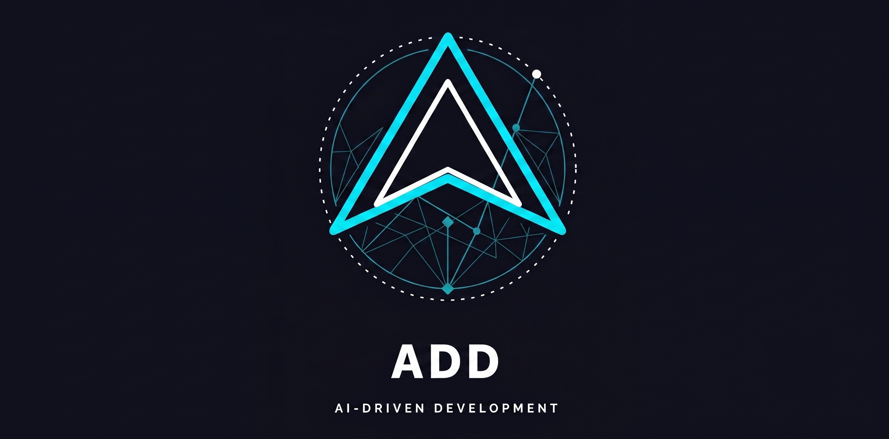

<p align="center">
  
</p>

<p align="center">
  <a href="https://www.npmjs.com/package/@pilotspace/add"></a>
  <a href="https://pypi.org/project/pilotspace-add/"></a>
  <a href="https://github.com/pilotspace/ADD/blob/main/LICENSE"></a>
  <a href="https://pilotspace.github.io/ADD/"></a>
  <a href="https://github.com/pilotspace/ADD/stargazers"></a>
</p>

<h1 align="center">ADD — AI-Driven Development</h1>
<p align="center"><strong>Your AI's first milestone is always great. ADD is for every milestone after that.</strong></p>
<p align="center">Describe the feature. The agent drives the build. You approve once — right where a mistake would actually cost you.</p>

---

## AI coding doesn't fail on day one — it rots

Every AI tool ships a beautiful first feature. The failure shows up **across
milestones**: requirements evolve, the conversation gets long, and the agent
quietly re-breaks what it already got right. That decay has a name — **context
rot** — and we measure it instead of hand-waving.

The cause turned out to be simple: **context rot lives in the conversation, not
in the method or the model.** The same agent that decays inside one long chat
holds a perfect line when every milestone restarts from state on disk.

So ADD's answer isn't a bigger context window or a smarter summary. It's this:
**nothing that matters lives in the chat.** Spec, frozen contract, red suite,
gate records — all state on disk. Close the laptop, lose the session, swap the
agent: the next session resumes with one command and loses nothing.

| Same model, six evolving milestones | One long conversation | Fresh session per milestone, resumed from disk |
|---|---|---|
| Requirement coverage | **.92 → .75, never recovered** | **1.0 flat across all six** |
| An early spec violation | carried through **five more milestones**, never re-examined | **never introduced** — each session re-derived the shape from the spec |
| New-feature quality at milestone 6 | still good — but the old promises rotted | **1.0** — new work stays good *and* old work holds |

<sub>[Campaign report, revised edition](./benchmark/results/2026-07-add-2.0-remeasure.md) — pinned model, deterministic probes, no LLM judge.</sub>

## What ADD is

An agent already knows how to write code. What it *structurally cannot* keep is
everything outside one context window: what's true so far, what was promised,
what must never be traded away. Human teams keep that in senior engineers' heads.
AI has no head that survives the session.

> **The agent is the hands. ADD is the memory, judgment, and conscience — the
> part of the team that survives when the context window doesn't.**

Every faculty is a file on disk and a command that shows it — never a promise:

| Faculty | What it holds | See it yourself |
|---|---|---|
| 🧠 **Memory** — *what is true* | the board, frozen contracts, red suites, five living specs | `add.py status` — a brand-new session resumes mid-build, losing nothing |
| ⚖️ **Judgment** — *how to work here* | personas propose each task's lane; gates trace outcomes; the loop reflects on the record (GEPA) | `add.py deltas` — the per-lane scoreboard: what got gated, passed, healed |
| 🛡️ **Conscience** — *what is trusted* | one freeze per feature, evidence-scored gates, tamper tripwire, security hard-stop | edit a frozen test and watch the gate refuse — gaming a test to get green is structurally impossible |

## ✨ Highlights

- 📉 **Your agent stops re-breaking last month's work** — every decision lives on disk, so a fresh session resumes with the full picture instead of a drifting memory. Measured: quality held flat where a long conversation decayed.
- ✅ **Stop babysitting the build** — you approve once, at the frozen contract; from there the agent drives Direction → Build → Verify on its own and only comes back when it matters.
- 🔬 **Know it's correct without reading every line** — trust comes from your pre-declared tests passing, never a diff that merely *looks* right. Gaming a test to go green is treated as tampering, not a shortcut.
- 💸 **Structure without the ceremony tax** — a thin 31-verb kernel and a 3-call task walk keep ADD the cheap option, competitive with the lightest structured flows.
- 🔒 **Never ship a security hole on autopilot** — any security finding is a hard stop with you in the loop, in every mode, even the fully-autonomous ones.
- 🧠 **The method adapts to *your* codebase** — a persona proposes each task's approach, outcomes are traced, and the loop learns what actually works here (GEPA).
- 🧭 **The agent reasons before it drafts** — a built-in reasoning floor makes it restate your goal in your words, tag what it *checked* versus what it *remembers*, and run a cheap kill-test on its own plan — catching the fluent-but-wrong that reads fine in a diff. Fluent ≠ true.
- 📄 **Everything about a feature in one place** — spec, scenarios, contract, tests, and gate record in a single `PLAN.md`; no doc tree to hunt through.
- 🎨 **See the UI before a line of code** — a wireframe and a zero-dependency HTML mock, approved before any build.
- 👥 **Grows with your team** — git-native multi-user, N parallel milestones, DAG-scheduled waves.
- 🤝 **Keep the agent you already use** — Claude, Copilot, Cursor, Codex, Gemini; install via npm, pip, or the Claude Code plugin.

> _Direction before speed. Trust comes from passing tests — not from reading code and finding it plausible._

<sub>**Fine print:** benchmark cells are single-rep (direction, not statistical proof). On this friendly single-app workload a strong model under spec-kit also passed the restart floors, and ran cheaper — the report's revised edition retracts our own earlier "collapse" claim after we found the meter defect behind it. ADD's case rests on the context-rot result and the structural guarantees — not on a rival's failure.</sub>

## ADD vs vanilla — when it earns its keep

ADD isn't free. It asks for one thing vanilla prompting doesn't: **you approve a
frozen contract before any code is written.** That upfront pass is the whole
trade — you spend minutes on direction to buy trust that holds across milestones.

|  | 🏃 **Vanilla** — just prompt the agent | 🛡️ **ADD** |
|---|---|---|
| **First feature** | fastest — start typing | one Direction pass first, then builds |
| **Across milestones** | quality decays; old promises silently break | frozen contracts + red suites re-run; trust holds |
| **What you verify** | you re-read the diff and hope | pre-declared tests pass, or the gate refuses |
| **Resuming later** | re-explain the goal, re-read the repo | one command from `state.json`, lossless |
| **Cost** | near-zero ceremony up front | one bounded direction pass per milestone — minutes, not a doc tree |
| **Best for** | throwaway scripts, one-shots, spikes | evolving products, multiple milestones, teams |

**Rule of thumb:** building something you'll throw away this week? Vanilla is
fine. Building something you'll still be changing next month? The Direction pass
pays for itself the first time the agent *doesn't* re-break a feature you shipped
three milestones ago.

---

## 🚀 Get Started


**Prerequisites:** Node ≥ 18 *(npm path)* or Python ≥ 3.10 *(pip path)*, plus a CLI coding agent — Claude Code, Codex, or similar.

### 1 · Install into your project

From your project root, pick one ecosystem:

```bash
npx @pilotspace/add init      # Node / npm
```
```bash
pip install pilotspace-add && pilotspace-add init      # Python / pip
```
```text
# Claude Code plugin — no npm or pip needed
/plugin marketplace add pilotspace/ADD
/plugin install add@add-method
```

> See a real one: this repo's own [`.add/`](https://github.com/pilotspace/ADD/tree/main/.add) folder.

### 2 · Spawn your first feature

In Claude Code, run **`/add`** and say what you want to build:

```bash
/add 'Let users log in with email + password / SSO, and keep them signed in for 30 days unless they explicitly log out.'
```

The agent runs the on-ramp for you:

1. 🧭 **Orients** from `add.py status` — never re-reading your whole repo.
2. 📐 **Sizes** your request into a **milestone** — *you confirm the shape.*
3. ✍️ **Drafts** each task's **Direction bundle** — Spec + Scenarios + Contract + red Tests in one pass — *you give one approval, at the frozen contract.*
4. ✅ **Runs** Build → Verify to green; a security finding always stops back to you.

### 3 · Resume anytime

```markdown
/add status | continue
```

State lives on disk, not in the chat. Close your laptop, come back tomorrow, and
pick up exactly where you left off — no context rot.

---

## ⚙️ How ADD Works

**One task · three beats · one file.** Every feature is a single **`PLAN.md`** that
fills in section by section as the agent walks three beats — **Direction** (spec →
scenarios → frozen contract → red tests, the *one* human approval), **Build**
(red → green, scope-fenced), **Verify** (evidence-scored gate: `PASS`,
`RISK-ACCEPTED`, or `HARD-STOP`). The artifacts are what you keep — the code is disposable.


**Tasks compound into milestones; milestones grow the project.**


---

## 📚 Learn More

- 📖 [Read the book](https://pilotspace.github.io/ADD/) — the full AIDD method, chapter by chapter
- ⚖️ [ADD vs spec-kit — the honest comparison](https://pilotspace.github.io/ADD/appendix-h-add-vs-spec-kit/) — where we tie, where they win, what only ADD guarantees
- ⚡ [2-minute Getting Started](./GETTING-STARTED.md) · 🔍 [Full hands-on walkthrough](./add-method/GETTING-STARTED.md)
- 📊 [Benchmark results](./benchmark/) — every trust and cost claim, reproducible from this repo
- 📦 [Package source](./add-method/README.md) · [Changelog](./add-method/CHANGELOG.md)
- 🗞️ [ADD Across the Org: AI-Driven Development Beyond Code](https://inkpaper-blog.pages.dev/series/add-across-the-org/)

**Releases:** [`@pilotspace/add`](https://www.npmjs.com/package/@pilotspace/add) (npm) · [`pilotspace-add`](https://pypi.org/project/pilotspace-add/) (PyPI)

---

## Star History

<a href="https://www.star-history.com/?repos=pilotspace%2FADD&type=date&legend=top-left">
 <picture>
   <source media="(prefers-color-scheme: dark)" srcset="https://api.star-history.com/chart?repos=pilotspace/ADD&type=date&theme=dark&legend=top-left" />
   <source media="(prefers-color-scheme: light)" srcset="https://api.star-history.com/chart?repos=pilotspace/ADD&type=date&legend=top-left" />
   
 </picture>
</a>

---

<p align="center">MIT License · <a href="https://github.com/pilotspace/ADD">pilotspace/ADD</a></p>
