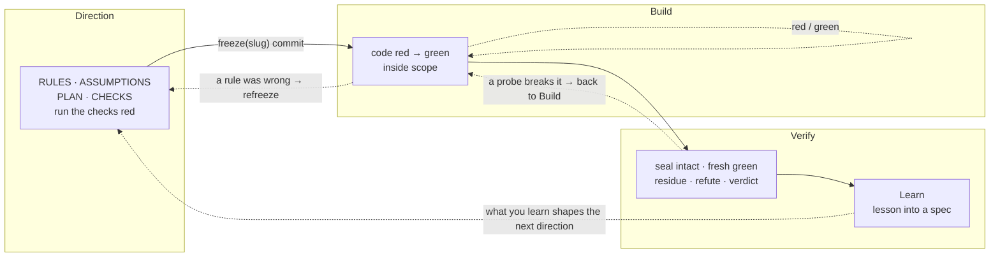

# 02 · The loop, and what is disposable

[← 01 Core principles](./01-principles.md) · [Contents](./README.md) · Next: [03 Direction — rules, assumptions, checks, the seal →](./03-direction.md)

---

## The loop

ADD is one repeatable loop with **three beats**, run on one task file:

**DIRECTION → (the `freeze` commit) → BUILD → VERIFY.**

- **Direction** is the steering. The agent grounds itself in the code the task touches, then writes `.add/tasks/<slug>.md`: its **RULES** (what it must do and must refuse), its **ASSUMPTIONS** (every silence it had to fill), its **PLAN** (scope, surfaces, the commands that check it) and its **CHECKS** (tests that will judge the build). It runs the checks, watches them fail for the right reason, and commits the task file and the checks together as `freeze(<slug>)`. That commit is the seal.
- **Build** is the engine. The agent writes code until the checks pass, staying inside `scope:` and never touching a sealed file.
- **Verify** is the proof. The agent confirms the sealed files are unchanged since the freeze commit, runs the checks and the full suite fresh on the committed tree, reads the diff for what tests cannot show, tries to break its own green, and writes one verdict with the real output into `## EVIDENCE`, committed as `verify(<slug>): <verdict>`.

After Verify comes **Learn**: a lesson worth keeping goes into the matching living spec, where it shapes the next task's Direction.

> **Solid arrows are the forward path** — you never open a beat before its input exists. **Dashed arrows are backward correction** — any beat may return to an earlier one to repair its artifact. A build that shows a rule was wrong goes back to Direction and lands as a `refreeze(<slug>): <why>` commit. That is the loop working ([principle 4](./01-principles.md)), and git history shows it.

## Nobody approves in the middle

Earlier versions of ADD stopped the run at the freeze for a human signature. 4.0 does not. The agent routes, seals, builds and verifies on its own, and the human reviews the finished work: the session report puts any `HARD-STOP` first, then lists per task the goal, the verdict, the freeze commit, the evidence and **every assumption the agent took**. Disagreeing is easy — the report says exactly which reading was taken and what it would cost if wrong.

This is not less review. It is review aimed at the right thing: a person reads the decisions and the evidence once, at the end, instead of approving a draft before anything has been proven.

## Many tasks: listed up front, written just in time

A milestone holds several tasks. It lists them breadth-first when it is created — `slug — one line (after: <dependency>)` — and then runs each task's loop only when work reaches it. A later task's direction absorbs what earlier tasks taught; a task file written too early rots before you arrive at it. Breadth is planned once; depth is earned one task at a time.

## Why the order is the order

Each beat produces what the next one needs.

| Beat | Produces | Needed by |
|------|----------|-----------|
| Direction | the sealed rules, assumptions and failing checks | Build (its target) and Verify (its standard) |
| Build | the code, at green | Verify |
| Verify | a verdict on evidence, in the task file | the report, the release, the next loop |

**Backward correction is always allowed; forward skipping never is.** Once a task is `done`, its `## EVIDENCE` is not rewritten. New findings about it become a new task that says which one it follows up.

## Who does what

| | The agent | The human |
|---|---|---|
| Direction | grounds itself in the code, writes rules, assumptions and checks, runs them red, seals | sets the goal; later reads the assumptions |
| Build | codes to green inside scope | — |
| Verify | proves the seal, runs fresh, reads residue, refutes, writes the verdict | reads the report and the evidence; owns the response to any `HARD-STOP` |
| Learn | records lessons with evidence | decides which lessons become binding decisions |

## What survives, and what is disposable

**The direction is the durable asset.** Rules, assumptions, contracts, checks and evidence capture decisions and meaning. They are what you protect and carry forward.

**The code is disposable.** It is one implementation that satisfies the sealed direction. If a better approach appears, or the model improves, it can be regenerated against the same rules and checks without loss.

A quick test of whether a team has absorbed this: ask what they would be upset to lose. If the answer is "the code", they are still working the old way. If it is "the contracts and the checks", they are working in ADD.

> **Do:** invest in clear rules, honest assumptions and discriminating checks.
> **Don't:** measure progress by how much code was generated.

The next chapters take each beat in turn: [Direction](./03-direction.md), [Build](./04-build.md), [Verify](./05-verify.md), and [Learn](./06-the-loop.md).
